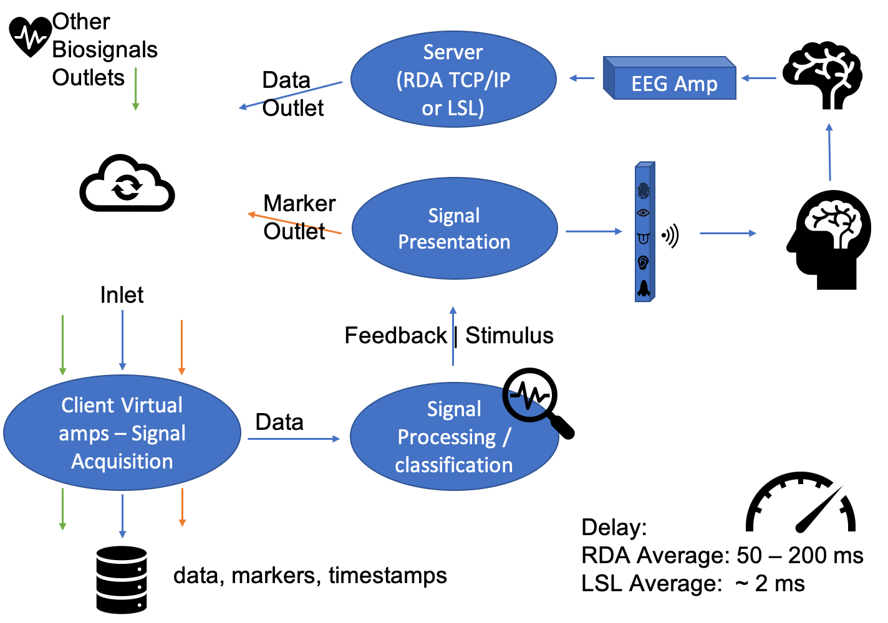

# NeuroPrime
A framework for real-time HCI/BCI. Specifically developed for advanced research of human-computer assisted self-regulation of Neurofeedback.


Simplicity and reusability are the foundation of NeuroPrime package, as is intended to be an open source project to be used by the neuroscience community. It is also intended to be a BCI hub that evolves with a synthesis of the best packages the python community has to offer in terms of signal processing, signal presentation and signal acquisition. Therefore, it should provide an easy and simple structure to update and connect new packages within the same design.

## Basic layout


## Overview

NeuroPrime toolbox by @nmc-costa.

NeuroPrime was built on Python open source language, synthesizing while using the best parts, we extensively tested, from specific BCI and EEG modules, for signal acquisition, signal processing/classification and signal presentation (diagram above). Signal Acquisition: pycorder (Brain Products, Gilching, Germany), pylsl/lab streaming layer (SCCN, 2014), and mushu (Venthur & Blankertz, 2012). Signal processing/classification: wyrm (Venthur & Blankertz, 2014) and mne (Gramfort et al., 2013). Signal presentation: pyff (Venthur et al., 2010) and psychopy (Peirce, 2007). Additionally, some other important packages, pandas for managing data, matplotlib for graphs, numpy for arrays, scipy for specific algorithms, pygatt for bluethooth connectivity with GSR and HR sensors, and also pyqtgraph for real-time graphical interfaces (Jones, Oliphant, & Peterson, 2001; Mckinney, 2010; Oliphant, 2006).

Framework for EEG Neurofeedback in python. Needed for simple experiment deployment and future online machine learning.

## Installation

Follow the tutorial.ipynb jupyter file for installation.

The tutorial goes through the simulation and testing of the toolbox using Experiment 2 BCI (e2_BCI). 

Results of Experiment 2 are published in paper ["A Multivariate Randomized Controlled Experiment about the Effects of Mindfulness Priming on EEG Neurofeedback Self-Regulation Serious Game"](https://www.mdpi.com/2076-3417/11/16/7725). Using e2_BCI you can replicate and validate our results.

## Toolbox Architecture

TOOlBOX_ARCHITECTURE.pdf gives a detailed overview of the toolbox.

The following paper discuss the theoretical framework foundations. ["NeuroPrime: a Pythonic framework for the priming of brain states in self-regulation protocols"](https://ieeexplore.ieee.org/document/9551893).

## TODO

- 1. Update to Python 3. 
    - 1.1. NeuroPrime is ready for Python 3. However some of the external packages, especially Pyff, are still python 2.7 package dependent. As such we decided to conform to the same environment.
    - 1.2. Psychopy is Python 3 compliant, and the signal presentation will need to be fully updated to this package.
    - 1.3. [Neurodecode] (https://github.com/dbdq/neurodecode) is another great BCI package that can support the transition to Python 3, as they have signal acquisition and signal processing using only MNE and Pylsl in Python 3
- 2. Continually clean code, conform to style and update documentation.
- 3. Further standardize upper and lowercase variables
    
    
## Citations
If you use NeuroPrime for anything We humbly ask you to cite us:
```bibtex
@inproceedings{DaCosta2021,
  author={Da Costa, Nuno M. C. and Bicho, Estela G. and Dias, Nuno S.},
  booktitle={2021 IEEE 9th International Conference on Serious Games and Applications for Health(SeGAH)}, 
  title={NeuroPrime: a Pythonic framework for the priming of brain states in self-regulation protocols}, 
  year={2021},
  volume={},
  number={},
  pages={1-8},
  doi={10.1109/SEGAH52098.2021.9551893}}

@article{Costa2021,
author = {da Costa, Nuno M. C. and Bicho, Estela and Ferreira, Flora and Vilhena, Estela and Dias, Nuno S.},
doi = {10.3390/APP11167725},
file = {::},
journal = {Applied Sciences 2021, Vol. 11, Page 7725},
keywords = {assisted Neurofeedback,mindfulness,neurostimulation,randomized,regulation,self,serious games BCI},
mendeley-groups = {PhD,MeusArtigos},
month = {aug},
number = {16},
pages = {7725},
publisher = {Multidisciplinary Digital Publishing Institute},
title = {{A Multivariate Randomized Controlled Experiment about the Effects of Mindfulness Priming on EEG Neurofeedback Self-Regulation Serious Games}},
url = {https://www.mdpi.com/2076-3417/11/16/7725},
volume = {11},
year = {2021}
}

@inproceedings{DaCosta2020,
author = {{Da Costa}, Nuno M.C. and Bicho, Estela G. and Dias, Nuno S.},
booktitle = {2020 IEEE 8th International Conference on Serious Games and Applications for Health, SeGAH 2020},
doi = {10.1109/SeGAH49190.2020.9201841},
isbn = {9781728190426},
keywords = {Self-regulation,assisted neurofeedback,mindfulness,neuromodulation,neurostimulation},
mendeley-groups = {MeusArtigos},
month = {aug},
pages = {1--8},
publisher = {IEEE},
title = {{Priming with mindfulness affects our capacity to self-regulate brain activity?}},
url = {https://ieeexplore.ieee.org/document/9201841/},
year = {2020}
}

@inproceedings{DaCosta2019,
author = {{Da Costa}, Nuno Miguel and Bicho, Estela and Dias, Nuno},
booktitle = {Frontiers in Cellular Neuroscience},
doi = {10.3389/conf.fncel.2019.01.00050},
issn = {1662-5102},
mendeley-groups = {MeusArtigos,PhD},
publisher = {Frontiers Media SA},
title = {{Does priming subjects, with not only resting state but also with mindfulness or/and guided imagery, affect self-regulation of SMR neurofeedback? Framework to improve brain self-regulation and support the rehabilitation of disorders such as depression, anxiety, stress and attention control.}},
url = {https://www.frontiersin.org/10.3389/conf.fncel.2019.01.00050/event_abstract},
volume = {13},
year = {2019}
}


```
